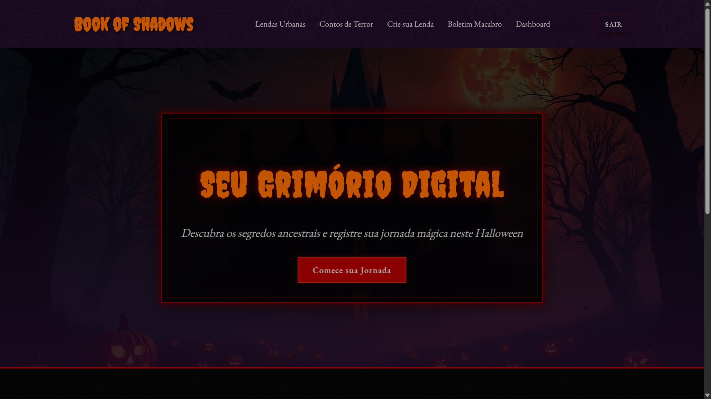
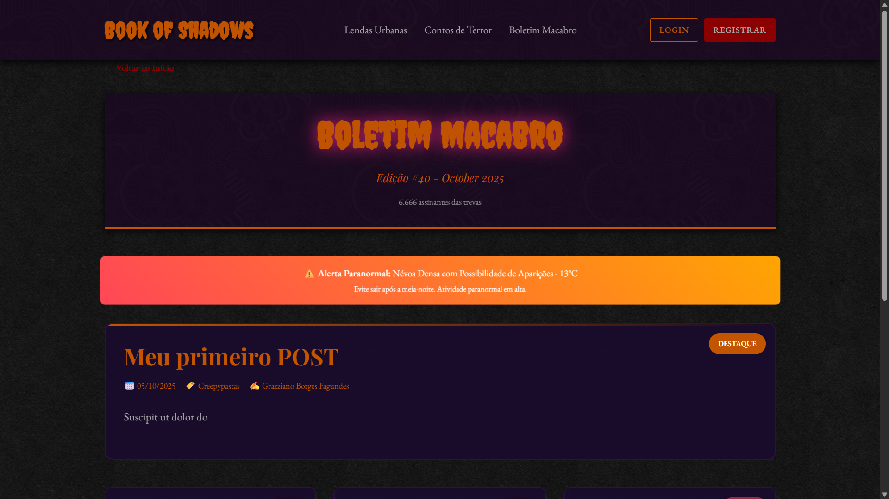
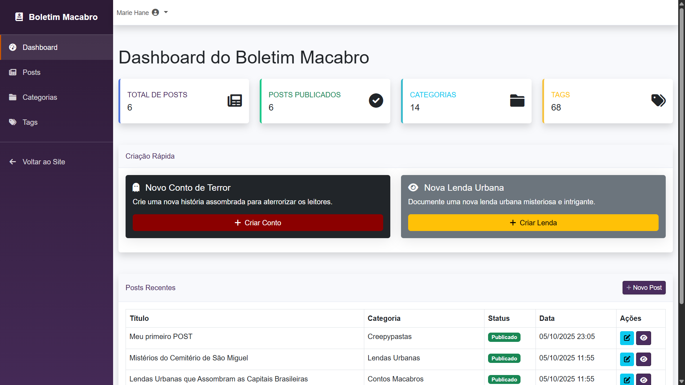

# 📖 Book of Shadows 🕯️🎃

Um site temático de **Halloween** desenvolvido em **Laravel** com **Bootstrap**, que reúne **lendas, contos macabros** e permite que usuários publiquem suas próprias histórias assustadoras.  

Além disso, o projeto possui um **Boletim Macabro** com relatos enviados pela comunidade, e um **dashboard administrativo** para gerenciar postagens, categorias e tags.

---

## 🚀 Funcionalidades

- 📚 **Lendas e contos** – catálogo de histórias e mitos de terror.  
- ✍️ **Publicação de histórias** – usuários podem compartilhar seus próprios relatos.  
- 📰 **Boletim Macabro** – seção especial com relatos da comunidade.  
- 🛠️ **Dashboard administrativo**:  
  - Gerenciamento de posts.  
  - Gerenciamento de categorias.  
  - Gerenciamento de tags.  

---

## 🛠️ Tecnologias Utilizadas

- [Laravel 12.x](https://laravel.com/) – framework backend.  
- [Bootstrap 5](https://getbootstrap.com/) – estilização responsiva.  
- [MySQL/MariaDB](https://www.mysql.com/) – banco de dados relacional.
<!-- - [Docker & Docker Compose](https://www.docker.com/)     -->
- [Blade Templates](https://laravel.com/docs/blade) – sistema de views do Laravel.  
- [Composer](https://getcomposer.org/) – gerenciamento de dependências PHP.  
- [NPM](https://www.npmjs.com/) – gerenciamento de pacotes frontend.  

---

## 📂 Estrutura do Projeto

```

book-of-shadows/
├── app/                # Lógica da aplicação
├── bootstrap/          # Arquivos do bootstrap do Laravel
├── config/             # Configurações do sistema
├── database/           # Migrations, seeders e factories
├── public/             # Arquivos públicos (CSS, JS, imagens)
├── resources/
│   ├── views/          # Views Blade (frontend e dashboard)
│   └── sass/           # Arquivos de estilo
├── routes/             # Rotas (web.php, api.php)
├── tests/              # Testes automatizados
└── ...

```

---

## ⚙️ Instalação e Configuração

1. **Clonar o repositório:**
   ```bash
   git clone https://Grazziano@bitbucket.org/grazziano/book-of-shadows.git
   cd book-of-shadows
   ```

2. **Instalar dependências do PHP com Composer:**

   ```bash
   composer install
   ```

3. **Instalar dependências do frontend:**

   ```bash
   npm install && npm run dev
   ```

4. **Configurar o arquivo `.env`:**

   * Copiar o arquivo `.env.example` para `.env`
   * Configurar banco de dados e demais variáveis de ambiente

   ```bash
   cp .env.example .env
   php artisan key:generate
   ```

5. **Rodar migrations e seeders:**

   ```bash
   php artisan migrate --seed
   ```

6. **Subir o servidor local:**

   ```bash
   php artisan serve
   ```

---

<!-- ## 🐳 Execução com Docker

Se preferir rodar a aplicação em containers:

### 1. Subir os containers

```bash
docker-compose up -d --build
```

### 2. Acessar o container do Laravel

```bash
docker exec -it book-of-shadows-app bash
```

### 3. Dentro do container, rodar comandos iniciais:

```bash
composer install
cp .env.example .env
php artisan key:generate
php artisan migrate --seed
npm install && npm run build
```

### 4. Acessar o site:

👉 [http://localhost:8000](http://localhost:8000)

---

## 🐋 Estrutura do Docker

### `Dockerfile`

```dockerfile
FROM php:8.3-fpm

# Instalar dependências do sistema
RUN apt-get update && apt-get install -y \
    git zip unzip curl libpng-dev libjpeg-dev libfreetype6-dev libonig-dev libxml2-dev libzip-dev npm

# Extensões PHP
RUN docker-php-ext-install pdo_mysql mbstring exif pcntl bcmath gd zip

# Composer
COPY --from=composer:2.7 /usr/bin/composer /usr/bin/composer

# Definir diretório de trabalho
WORKDIR /var/www

COPY . .

RUN composer install && npm install && npm run build

EXPOSE 9000
CMD ["php-fpm"]
```

### `docker-compose.yml`

```yaml
version: '3.8'

services:
  app:
    build:
      context: .
      dockerfile: Dockerfile
    container_name: book-of-shadows-app
    restart: unless-stopped
    working_dir: /var/www
    volumes:
      - ./:/var/www
    networks:
      - book-network
    ports:
      - "8000:9000"
    depends_on:
      - db

  db:
    image: mysql:8.0
    container_name: book-of-shadows-db
    restart: unless-stopped
    environment:
      MYSQL_ROOT_PASSWORD: root
      MYSQL_DATABASE: book_of_shadows
      MYSQL_USER: laravel
      MYSQL_PASSWORD: secret
    ports:
      - "3307:3306"
    volumes:
      - db_data:/var/lib/mysql
    networks:
      - book-network

networks:
  book-network:

volumes:
  db_data:
``` -->

<!-- --- -->

## 🧙 Dashboard Administrativo

Acesse o painel de controle em `/admin` após autenticação.
Permite gerenciar:

* 🕮 **Posts** (criar, editar, excluir)
* 🕸️ **Categorias e Tags**
* 💀 **Histórias de usuários**
* 🩸 **Relatos do Boletim Macabro**
* 🎭 **Review de Filmes, Séries e Livros** (para usuários autenticados)
* 🔒 **Controle de Acesso** (usuários, permissões)
* 🔍 **Busca e Filtros** (para posts, histórias, relatos)

---

<!-- ## 📊 Dashboard

O projeto inclui um **painel administrativo** acessível apenas para usuários autenticados, permitindo:

* Criar, editar e excluir **posts**.
* Organizar **categorias** e **tags**.
* Moderação de **histórias enviadas por usuários**.

--- -->

## 📸 Imagens do Site

> Algumas capturas de tela das páginas principais do projeto.

|          Página Inicial         |            Boletim Macabro            |                 Dashboard                 |
| :-----------------------------: | :-----------------------------------: | :---------------------------------------: |
|  |  |  |

<!-- > As imagens devem ser colocadas na pasta:
> `public/screenshots/` -->

<!-- Você pode ajustar os nomes ou caminhos conforme a estrutura do seu projeto. -->

---

## 🔮 Roadmap (Próximas Melhorias)

* ✅ Autenticação de usuários (login, registro, recuperação de senha).
* ✅ Upload de imagens para histórias e posts.
* ⬜ Sistema de comentários.
* ⬜ Área de perfil do usuário.
* ⬜ SEO otimizado para histórias e lendas.
* ⬜ Integração com redes sociais para compartilhamento de histórias.

---

## 🎃 Créditos

Desenvolvido por [Grazziano](https://github.com/grazziano) 👨‍💻

Inspirado no espírito do **Halloween**, para reunir contos, lendas e relatos que gelam a espinha!
